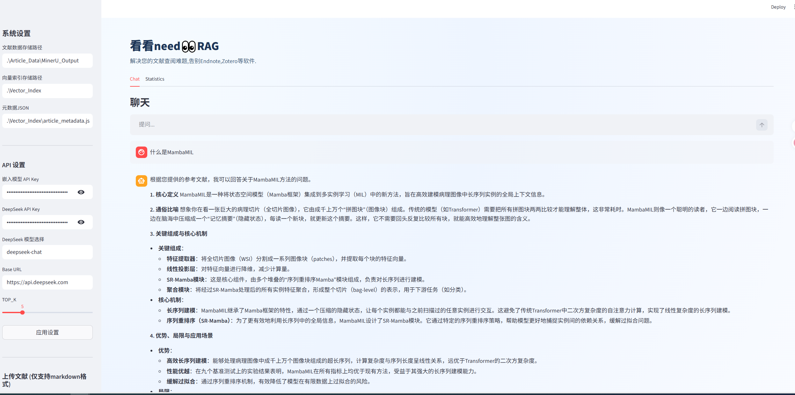
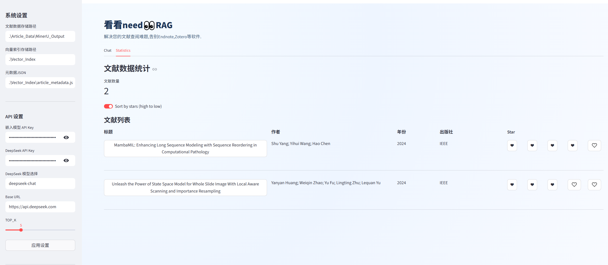

# KKNEED_RAG

一个面向学术文献场景的本地 RAG 系统，支持文献检索、问答、统计分析与增量更新，让你告别GPT,DeepSeek查询文献时的胡言乱语，摆脱Endnote,Zotero等复杂的文献管理软件。

## 功能特性

- 文献知识库构建：将文献内容切分并向量化，构建本地 FAISS 索引。
- 混合检索：结合向量检索与 BM25，并使用 RRF 进行重排。
- 多类型问答路由：支持 `list / concept / fact / method / summary / stats` 六类问题。
- 文献统计视图：可在界面中查看文献条目、来源、年份等统计信息。
- 增量更新：支持新增文献后仅更新新增部分，避免全量重建。

## 重要说明（文献格式）

本系统上传文献时，**仅支持 Markdown（`.md`）格式**。  
建议先将 PDF 等原始文献转换为 Markdown，再导入本系统。

推荐转换工具：MinerU  
地址：https://mineru.net/

## 项目结构

```text
KKNEED_RAG/
├─ Rag_Modules/          # 数据预处理、索引构建、检索优化、生成集成
├─ Article_Data/         # 文献数据目录（本地维护）
├─ Vector_Index/         # 向量索引目录（本地维护）
├─ streamlit_ui.py       # Streamlit 入口
├─ config_data.py        # 运行配置（通过 .env 注入API-KEY等敏感信息）
├─ .env.example          # 环境变量示例
└─ requirements.txt      # Python 依赖
```

## 快速开始

### 1) 安装依赖

```bash
pip install -r requirements.txt
```

### 2) 配置环境变量

复制 `.env.example` 为 `.env`，并填写密钥，注意嵌入模型采用的是text-embedding-v4模型，暂时无法更换：

```env
EMBEDDING_API_KEY=your_embedding_api_key
DEEPSEEK_API_KEY=your_deepseek_api_key
LLM_BASE_URL=https://api.deepseek.com
```

### 3) 启动项目

```bash
streamlit run streamlit_ui.py
```

### 4) 上传文献并构建索引

- 在侧边栏上传 `.md` 文献文件。
- 点击“更新向量索引”进行构建或增量更新。

## 效果展示






## 常见问题

### 为什么不直接上传 PDF？

当前流程基于 Markdown 文本处理，直接上传 PDF 不在当前支持范围内。建议先通过 MinerU 转换后导入。
